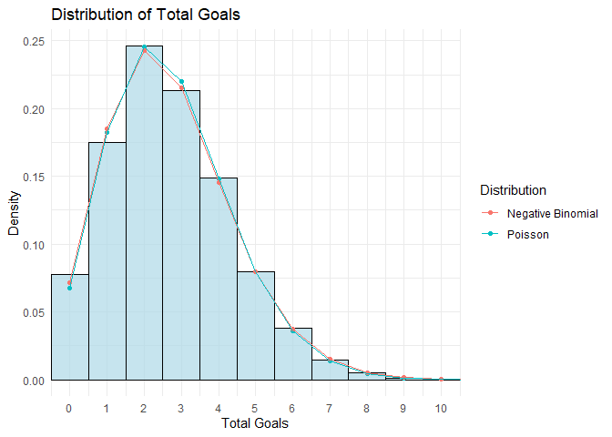
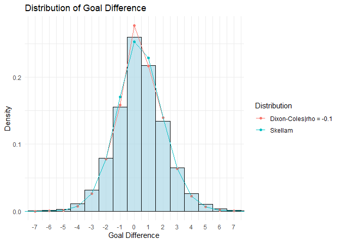
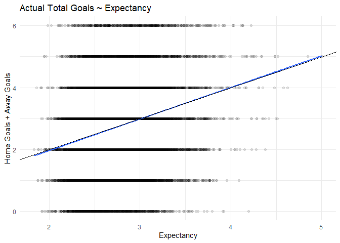
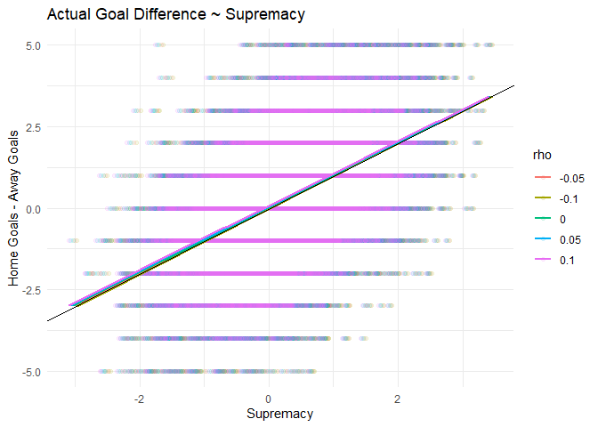
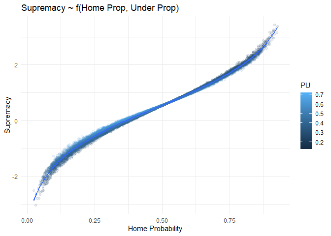

Expected Goals
================
Thanos Livanis
22/11/2023

**A simple model to estimate Goal Expectancy & Supremacy from
bookmaker’s odds**

*OU line is used to estimate goal Expectancy (homeG + awayG) & 1X2 odds
to estimate goal Supremacy(homeG - awayG)*

Dixon-Coles model: [Modelling Association Football Scores and
Inefficiencies](https://academic.oup.com/jrsssc/article/46/2/265/6990546)  
Data from
[football-data.co.uk](https://www.football-data.co.uk/data.php)  
Removing overround using [implied
package](https://opisthokonta.net/?p=1797)  

## Load data

``` r
rm(list = ls())

library(rvest) # read_html
library(data.table) 
library(implied)    
library(skellam)
library(fitdistrplus)
library(tidyverse)

options(scipen = 999)

# download league data from Football-data.co.uk
load_league_data <- function(league) {
  
  url_main <- "https://www.football-data.co.uk/"
  url_league <- paste0(url_main, league, "m.php")
  
  links <- read_html(url_league) %>% html_nodes("a") %>% html_attr("href")
  
  # main leagues end in (1|0).csv
  csv_links <- paste0(url_main, links[grep("(1|0)\\.csv$", links)])  
  
  read_url <- function(URL) { 
    tryCatch(read.csv(URL, stringsAsFactors = F, check.names = F, na.strings = c("NA", "")),
             error = function(e) {warning(conditionMessage(e)); NULL})
  }
  
  data <- lapply(csv_links, read_url)
  
  return (data)
}

leagues <- c("england", "scotland", "germany", "italy", "spain", 
             "france", "netherlands", "belgium", "portugal")

# Load all CSV files into a list
football_odds <- lapply(leagues, load_league_data) 

# Merge into a single dataframe & remove any NA rows and cols with very few observations (< 100)
football_odds <- football_odds %>% do.call(c, .) %>% rbindlist(fill = T) %>% 
  as.data.frame() %>% .[rowSums(is.na(.)) != ncol(.), colSums(is.na(.)) < nrow(.) - 100]
```

``` r
# Odds Abbreviations for 1x2, OU in Football-data.co.uk. Includes only instances where we have odds for both 1X2 and OU
odds_1X2 <- list(Bet365 = c("B365H", "B365D", "B365A"), Bet365C = c("B365CH", "B365CD", "B365CA"),
                 Pinnacle = c("PSH", "PSD", "PSA"), PinnacleC = c("PSCH", "PSCD", "PSCA"),
                 Market_Avg = c("AvgH", "AvgD", "AvgA")) 

odds_OU <- list(Bet365 = c("B365>2.5", "B365<2.5"), Bet365C = c("B365C>2.5", "B365C<2.5"), 
                Pinnacle = c("P>2.5", "P<2.5"), PinnacleC = c("PC>2.5", "PC<2.5"),
                Market_Avg = c("Avg>2.5", "Avg<2.5"))

odds_abbs <- list('1X2' = odds_1X2, OU = odds_OU)

# full time total goals, and goal difference
football_odds <- football_odds %>%
  mutate(ID = rownames(.),
         FTG = FTHG + FTAG,
         FTGD = FTHG - FTAG) 
```

## Total Goals distribution

Poisson and Negative Binomial fitting

``` r
# Fitted Poisson & Negative binomial distribution
fit <- map(c("pois", "nbinom"), fitdist, data = football_odds$FTG, method = "mle")

x_values <- 0:max(football_odds$FTG)

dp <- rbind(
  data.frame(x = x_values, 
             y = dpois(x_values, lambda = fit[[1]]$estimate), 
             Distribution = "Poisson"),
  data.frame(x = x_values, 
             y = dnbinom(x_values, size = fit[[2]]$estimate[1], mu = fit[[2]]$estimate[2]), 
             Distribution = "Negative Binomial"))

ggplot(football_odds, aes(x = FTG)) +
  geom_histogram(aes(y = ..density..), binwidth = 1, fill = "lightblue", color = "black", alpha = 0.7) +
  geom_point(data = dp, aes(x, y, color = Distribution)) + 
  geom_line(data = dp, aes(x, y, color = Distribution)) + 
  scale_x_continuous(breaks = seq(0, 10, by = 1)) +
  coord_cartesian(xlim = c(0, 10)) +
  labs(x = "Total Goals", y = "Density", title = "Distribution of Total Goals") +
  theme_minimal() 
```



## Goal difference distribution

Skellam (difference of two independent Poisson) & Dixon-Coles

``` r
# customized density function that gives the probability that x-y = d, using Dixon-Coles adjustment,
# Dixon-Coles model adjusts probabilities of (0,0), (0,1), (1,0), (1,1) scores
dDC <- function(d, lambda1, lambda2, rho = -0.1) {

  if (abs(d) > 1) return (dskellam(d, lambda1, lambda2))
    
  tau <- function(x, y){
    if (x == 0 & y == 0) return(1 - lambda1*lambda2*rho)
    else if (x == 0 & y == 1) return(1 + lambda1*rho)
    else if (x == 1 & y == 0) return(1 + lambda2*rho) 
    else if (x == 1 & y == 1) return(1 - rho)
    else return(1)
  }
  
  Pxy_pois <- function(x, y) {dpois(x, lambda1)*dpois(y, lambda2)}
  Pxy <- function(x, y) {tau(x, y)*Pxy_pois(x, y)}

  combinations <- data.frame(x = c(0, 0, 1, 1), y = c(0, 1, 0, 1)) %>%
    filter(x - y == d)
  
  p_dc <- map2_dbl(combinations$x, combinations$y, Pxy) %>% sum()
  p_pois <- map2_dbl(combinations$x, combinations$y, Pxy_pois) %>% sum()
  
  p <- p_dc + (dskellam(d, lambda1, lambda2)- p_pois)
    
  return (p)
  
}
  

x_values <- min(football_odds$FTGD):max(football_odds$FTGD)

dp <- rbind(
  data.frame(x = x_values, 
             y = dskellam(x_values, lambda1 = mean(football_odds$FTHG),lambda2 = mean(football_odds$FTAG)),
             Distribution = "Skellam"),
  data.frame(x = x_values, 
             y = sapply(x_values, dDC, lambda1 = mean(football_odds$FTHG),lambda2 = mean(football_odds$FTAG)), 
             Distribution = "Dixon-Coles|rho = -0.1"))


ggplot(football_odds, aes(x = FTGD)) +
  geom_histogram(aes(y = ..density..), binwidth = 1, fill = "lightblue", color = "black", alpha = 0.7) +
  geom_point(data = dp, aes(x, y, color = Distribution)) + 
  geom_line(data = dp, aes(x, y, color = Distribution)) + 
  scale_x_continuous(breaks = seq(-7, 7, by = 1)) +
  coord_cartesian(xlim = c(-7, 7)) +
  theme_minimal() +
  labs(x = "Goal Difference", y = "Density", title = "Distribution of Goal Difference") 
```



## Iterate to find goal expectancy & supremacy

``` r
# Given Under probability find the mean of the Poisson distribution
expectancy <- function(under_prop, under_line = 2.5) {
  
  pois_model <- function(expg){
    (ppois(floor(under_line), lambda = expg) - under_prop)
  }
  
  exp <- tryCatch(uniroot(f = pois_model, interval = c(0.01, 10))$root,
                  error = function(e) {warning(conditionMessage(e)); NA})
  
  return (exp)
}


# Given goal expectancy and probability of Home team to win get supremacy
# win probability of HT is the CDF of the adjusted Skellam 
# @rho: default value 0 -> standard Skellam 
supremacy <- function(home_prop, exp, rho = 0) {
  
  dc_model <- function(sup){
    
    home_exp <- (exp + sup)/2 
    away_exp <- (exp - sup)/2 
    
    p_home = pskellam(0, home_exp, away_exp, lower.tail = F) + rho*away_exp*dpois(1, home_exp)*dpois(0, away_exp)
    
    return (p_home - home_prop)  
  }
  
  sup <- tryCatch(uniroot(dc_model, interval = c(-0.9*exp, 0.9*exp), tol = 0.005)$root, 
                  error = function(e) {warning(conditionMessage(e)); NA})
  
  return (sup)
}
```

``` r
fair_propabilities <- function(data, bookmaker, market, method) {
  
  odds <- odds_abbs[[market]][[bookmaker]]
  
  # Exclude invalid odds (overround > 1, all odds > 1)
  valid_overround <- rowSums(1/data[, odds], na.rm = T) > 1
  data <- data[valid_overround, ] %>% filter(across(all_of(odds), ~. > 1))

  fair_props <- implied_probabilities(data[, odds], method) 
  
  is_ok <- which(!fair_props[["problematic"]])  
  fair_props <- fair_props %>% .[["probabilities"]] %>% as.data.frame()
  
  fair_props <- if (market == "OU") 
    setNames(fair_props, c("PO", "PU"))
  else
    setNames(fair_props, c("PH", "PD", "PA"))
  
  data <- bind_cols(data[is_ok, ], fair_props[is_ok, ])
  
  return (data)
}

# @method: method to remove overround with implied package
expected_goals <- function(data, bookmaker, rho, method = "basic") {
  
  # Add fair probabilities for OU & 1X2
  data <- data %>% 
    fair_propabilities(bookmaker, "OU", method) %>%
    fair_propabilities(bookmaker, "1X2", method)
  
  data <- data %>% 
    mutate(Expectancy = sapply(PU, expectancy), 
           Supremacy = map2_dbl(PH, Expectancy, supremacy, rho = rho),
           Home_exp = (Expectancy + Supremacy)/2,
           Away_exp = (Expectancy - Supremacy)/2, 
           rho = as.character(rho), 
           method = method) %>%
    dplyr::select(ID, FTHG, FTAG, FTG, FTGD, PO, PU, PH, PD, PA, 
                  Expectancy, Supremacy, Home_exp, Away_exp, 
                  rho, method)
  
  return (data)
}


rho = seq(-0.1, 0.1, 0.05)

goal_expectancy <-  lapply(rho, expected_goals, data = football_odds, bookmaker = "Pinnacle") %>%
  do.call(rbind, .)
```

*Expectancy doesn’t depend on rho, supremacy does.*  
The **“Basic”** method from Implied package is not a good way to remove
bookmaker’s margin, but in this case, if we employ a simple
Dixon-Coles\|Skellam model to estimate win probability of home team it
seems to lead to better results, the other methods do not succeed. 
There isn’t much difference between different rho values, standard
Skellam (rho = 0) is fine.  

``` r
ggplot(filter(goal_expectancy, rho == "0"), aes(x = Expectancy, y = FTHG + FTAG)) +
  geom_point(alpha = 0.1) + geom_smooth(method = "lm", se = F) +
  geom_abline(slope = 1, intercept = 0) +
  labs(title = "Actual Total Goals ~ Expectancy", y = "Home Goals + Away Goals") +
  coord_cartesian(ylim = c(0, 6)) +
  theme_minimal() 
```



``` r
ggplot(goal_expectancy, aes(x = Supremacy, y = FTGD, color = rho)) +
  geom_point(alpha = 0.1) + geom_smooth(method = "lm", se = F) +
  geom_abline(slope = 1, intercept = 0) +
  labs(title = "Actual Goal Difference ~ Supremacy", y = "Home Goals - Away Goals") +
  coord_cartesian(ylim = c(-5, 5)) +
  theme_minimal() 
```



``` r
ggplot(filter(goal_expectancy, rho == "0"), aes(x = PH, y = Supremacy, color = PU)) +
  geom_point(alpha = 0.1) + geom_smooth(method = "lm", formula = y ~ poly(x,8), se = F) +
  labs(title = "Supremacy ~ f(Home Prop, Under Prop)",
       x = "Home Probability") +
  theme_minimal() 
```


