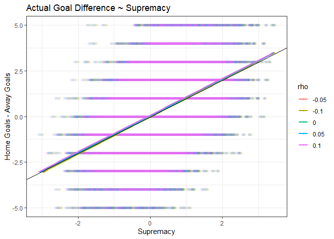
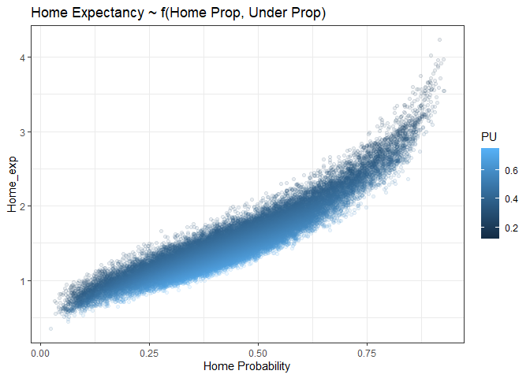

Expected Goals
================
Thanos Livanis
22/11/2023

**A simple model to estimate Goal Expectancy & Supremacy from
bookmaker’s odds**

*OU line is used to estimate goal Expectancy (homeG + awayG) & 1X2 odds
to estimate goal Supremacy(homeG - awayG)*

Dixon-Coles model: [Modelling Association Football Scores and
Inefficiencies](https://academic.oup.com/jrsssc/article/46/2/265/6990546)  
Data from
[football-data.co.uk](https://www.football-data.co.uk/data.php)  
Removing overround using [implied
package](https://opisthokonta.net/?p=1797)  

## Data

``` r
suppressPackageStartupMessages({
  library(implied)    
  library(skellam)
  library(fitdistrplus)
  library(tidyverse)
})

rm(list = ls())
options(scipen = 999)

football_odds <- readRDS(file = "./data-raw/football-data.rds")

# Odds Abbreviations for 1x2, OU in Football-data.co.uk. Includes only instances where we have odds for both 1X2 and OU
odds_1x2 <- list(Bet365 = c("B365H", "B365D", "B365A"), Bet365C = c("B365CH", "B365CD", "B365CA"),
                 Pinnacle = c("PSH", "PSD", "PSA"), PinnacleC = c("PSCH", "PSCD", "PSCA"),
                 MarketAvg = c("AvgH", "AvgD", "AvgA")) 

odds_ou <- list(Bet365 = c("B365>2.5", "B365<2.5"), Bet365C = c("B365C>2.5", "B365C<2.5"), 
                Pinnacle = c("P>2.5", "P<2.5"), PinnacleC = c("PC>2.5", "PC<2.5"),
                MarketAvg = c("Avg>2.5", "Avg<2.5"))

odds_abbs <- list('1X2' = odds_1x2, OU = odds_ou)

# full time total goals, goal difference, and goal-goal
football_odds <- football_odds %>%
  mutate(ID = rownames(.),
         FTG = FTHG + FTAG,
         FTGD = FTHG - FTAG, 
         GG = ifelse(FTHG >= 1 & FTAG >= 1, T, F)) 
```

## Total Goals distribution

Poisson and Negative Binomial fitting

``` r
# Fitted Poisson & Negative binomial distribution
fit <- map(c("pois", "nbinom"), fitdist, data = football_odds$FTG, method = "mle")

x_values <- 0:max(football_odds$FTG)

dp <- rbind(
  data.frame(x = x_values, 
             y = dpois(x_values, lambda = fit[[1]]$estimate), 
             Distribution = "Poisson"),
  data.frame(x = x_values, 
             y = dnbinom(x_values, size = fit[[2]]$estimate[1], mu = fit[[2]]$estimate[2]), 
             Distribution = "Negative Binomial"))

ggplot(football_odds, aes(x = FTG)) +
  geom_histogram(aes(y = after_stat(density)), binwidth = 1, fill = "lightblue", color = "black", alpha = 0.7) +
  geom_point(data = dp, aes(x, y, color = Distribution)) + 
  geom_line(data = dp, aes(x, y, color = Distribution)) + 
  scale_x_continuous(breaks = seq(0, 10, by = 1)) +
  coord_cartesian(xlim = c(0, 10)) +
  theme_bw() +
  labs(x = "Total Goals", y = "Density", title = "Distribution of Total Goals")  
```


## Goal difference distribution

Skellam (difference of two independent Poisson) & Dixon-Coles

``` r
# Dixon-Coles adjusted density function 
# D-C model adjusts probabilities of (0,0), (0,1), (1,0), (1,1) scores
ddc <- function(x, y, lambda1, lambda2, rho) {
  
  tau <- function(x, y){
    if (x == 0 & y == 0) return(1 - lambda1*lambda2*rho)
    else if (x == 0 & y == 1) return(1 + lambda1*rho)
    else if (x == 1 & y == 0) return(1 + lambda2*rho) 
    else if (x == 1 & y == 1) return(1 - rho)
    else return(1)
  }
  
  return (tau(x, y)*dpois(x, lambda1)*dpois(y, lambda2))
}

# probability that x - y = d, using Dixon-Coles 
skellam_dc_adjusted <- function(d, lambda1, lambda2, rho = -0.1) {
  
  if (abs(d) > 1) return (dskellam(d, lambda1, lambda2))
  
  combinations <- data.frame(x = c(0, 0, 1, 1), y = c(0, 1, 0, 1)) %>% filter(x - y == d)
  
  prop_dc <- map2_dbl(combinations$x, combinations$y, ~ ddc(.x, .y, lambda1, lambda2, rho)) %>% sum()
  prop_pois <- map2_dbl(combinations$x, combinations$y, ~ dpois(.x, lambda1)*dpois(.y, lambda2)) %>% sum()
  
  p <- prop_dc + (dskellam(d, lambda1, lambda2)- prop_pois)
  
  return (p)
}

x_values <- min(football_odds$FTGD):max(football_odds$FTGD)

dp <- rbind(
  data.frame(x = x_values, 
             y = dskellam(x_values, lambda1 = mean(football_odds$FTHG),lambda2 = mean(football_odds$FTAG)),
             Distribution = "Skellam"),
  data.frame(x = x_values, 
             y = sapply(x_values, skellam_dc_adjusted, lambda1 = mean(football_odds$FTHG),lambda2 = mean(football_odds$FTAG)), 
             Distribution = "Dixon-Coles|rho = -0.1"))

ggplot(football_odds, aes(x = FTGD)) +
  geom_histogram(aes(y = after_stat(density)), binwidth = 1, fill = "lightblue", color = "black", alpha = 0.7) +
  geom_point(data = dp, aes(x, y, color = Distribution)) + 
  geom_line(data = dp, aes(x, y, color = Distribution)) + 
  scale_x_continuous(breaks = seq(-7, 7, by = 1)) +
  coord_cartesian(xlim = c(-7, 7)) +
  theme_bw() +
  labs(x = "Goal Difference", y = "Density", title = "Distribution of Goal Difference") 
```


## Iterate to find goal expectancy & supremacy

``` r
# Given Under probability find the mean of the Poisson distribution
implied_expectancy <- function(under_prop, under_line = 2.5) {
  
  pois_model <- function(expg){
    (ppois(floor(under_line), lambda = expg) - under_prop)
  }
  
  exp <- tryCatch(uniroot(f = pois_model, interval = c(0.01, 10))$root,
                  error = function(e) {warning(conditionMessage(e)); NA})
  
  return (exp)
}

# Given goal expectancy and probability of Home team to win get supremacy
# win probability of HT is the CDF of the adjusted Skellam 
# @rho: default value 0 -> standard Skellam 
implied_supremacy <- function(home_prop, exp, rho = 0) {
  
  dc_model <- function(sup){
    
    home_exp <- (exp + sup)/2 
    away_exp <- (exp - sup)/2 
    
    p_home = pskellam(0, home_exp, away_exp, lower.tail = F) + rho*away_exp*dpois(1, home_exp)*dpois(0, away_exp)
    
    return (p_home - home_prop)  
  }
  
  sup <- tryCatch(uniroot(dc_model, interval = c(-0.9*exp, 0.9*exp), tol = 0.005)$root, 
                  error = function(e) {warning(conditionMessage(e)); NA})
  
  return (sup)
}

gg_prop <- function(home_exp, away_exp) {
  
  score <- matrix(nrow = 8, ncol = 8, dimnames = list(as.character(0:7), as.character(0:7)))
  
  for (h in 1:nrow(score)) {
    for (a in 1:ncol(score)) {
      score[h, a] <- ddc(h-1, a-1, home_exp, away_exp, -0.1)
    }
  }
  
  return(1 - (sum(score[, 1]) + sum(score[1, ]) - score[1, 1]))
}
```

``` r
fair_propabilities <- function(data, bookmaker, market, method) {
  
  odds <- odds_abbs[[market]][[bookmaker]]
  
  # Exclude invalid odds (overround > 1, all odds > 1)
  valid_overround <- rowSums(1/data[, odds], na.rm = T) > 1
  df <- data[valid_overround, ] %>% filter(if_all(all_of(odds), ~. > 1))
  
  fair_props <- implied_probabilities(df[, odds], method) 
  
  is_ok <- which(!fair_props[["problematic"]])  
  fair_props <- as.data.frame(fair_props[["probabilities"]])
  
  fair_props <- if (market == "OU") 
    setNames(fair_props, c("PO", "PU"))
  else
    setNames(fair_props, c("PH", "PD", "PA"))
  
  return (bind_cols(df[is_ok, ], fair_props[is_ok, ]))
}

# @method: method to remove overround with implied package
expected_goals <- function(data, bookmaker, rho, method = "basic") {
  
  data %>% 
    fair_propabilities(bookmaker, "OU", method) %>%
    fair_propabilities(bookmaker, "1X2", method) %>%
    select(FTHG, FTAG, FTG, FTGD, GG, PO, PU, PH, PD, PA) %>%
    
    mutate(Expectancy = sapply(PU, implied_expectancy), 
           Supremacy = map2_dbl(PH, Expectancy, implied_supremacy, rho = rho),
           Home_exp = (Expectancy + Supremacy)/2,
           Away_exp = (Expectancy - Supremacy)/2, 
           PGG = map2_dbl(Home_exp, Away_exp, gg_prop),
           rho = as.character(rho), 
           method = method) %>%
    drop_na()
}

rho <-  seq(-0.1, 0.1, 0.05)

goal_expectancy <- map_dfr(rho, expected_goals, data = football_odds, bookmaker = "Pinnacle") 
```

*Expectancy doesn’t depend on rho, supremacy does.*  
The **“Basic”** method from Implied package is not a good way to remove
bookmaker’s margin, but in this case, if we employ a simple
Dixon-Coles\|Skellam model to estimate win probability of home team it
seems to lead to better results, the other methods do not succeed. 
There isn’t much difference between different rho values, standard
Skellam (rho = 0) is fine.  

``` r
ggplot(filter(goal_expectancy, rho == "0"), aes(x = Expectancy, y = FTHG + FTAG)) +
  geom_point(alpha = 0.1) + geom_smooth(method = "lm", se = F) +
  geom_abline(slope = 1, intercept = 0) +
  labs(title = "Actual Total Goals ~ Expectancy", y = "Home Goals + Away Goals") +
  coord_cartesian(ylim = c(0, 6)) +
  theme_minimal() 
```


``` r
ggplot(goal_expectancy, aes(x = Supremacy, y = FTGD, color = rho)) +
  geom_point(alpha = 0.1) + geom_smooth(method = "lm", se = F) +
  geom_abline(slope = 1, intercept = 0) +
  labs(title = "Actual Goal Difference ~ Supremacy", y = "Home Goals - Away Goals") +
  coord_cartesian(ylim = c(-5, 5)) +
  theme_minimal() 
```



``` r
brier_score_gg <- goal_expectancy %>%
  mutate(BS = (GG - PGG)^2) %>%
  summarize(bs_avg = mean(BS), .by = rho) %>%
  arrange(bs_avg)

goal_expectancy %>%
  group_by(rho) %>%
  mutate(pgg_int = ntile(PGG, 100)) %>%
  group_by(pgg_int, .add = T) %>%
  summarise(obs = n(), 
            implied_prop = mean(PGG), 
            actual_prop = mean(GG), 
            .groups = "drop") %>%
  ggplot(aes(x = implied_prop, y = actual_prop, color = rho)) +
  geom_point() + geom_smooth(method = "lm", mapping = aes(weight = obs), se = F) + 
  geom_abline(slope = 1, intercept = 0) + theme_bw() +
  theme_bw() +
  labs(x = "Implied Probability", y = "Actual Probability", 
       title = "Goal-Goal probabilities")
```


``` r
ggplot(filter(goal_expectancy, rho == "0"), aes(x = PH, y = Supremacy, color = PU)) +
  geom_point(alpha = 0.1) + geom_smooth(method = "lm", formula = y ~ poly(x,8), se = F) +
  theme_bw() +
  labs(title = "Supremacy ~ f(Home Prop, Under Prop)",
       x = "Home Probability") 
```


