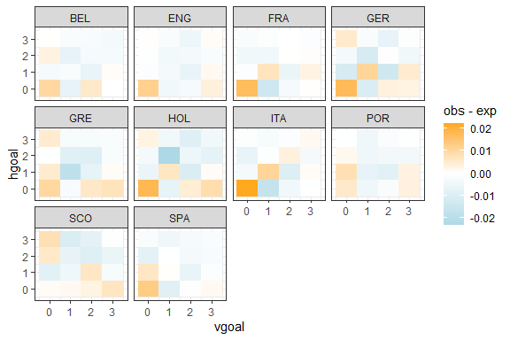
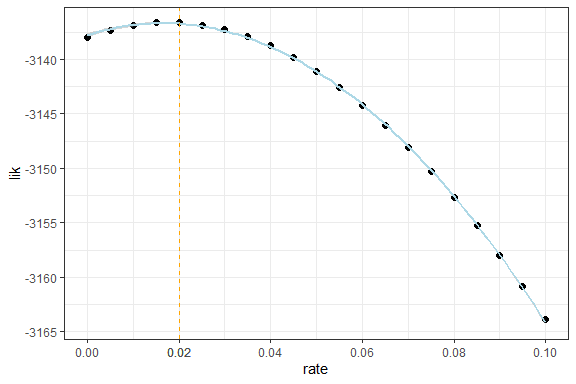
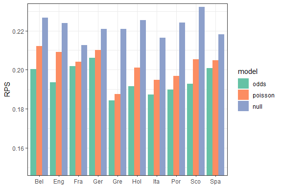
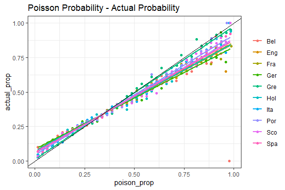

Poisson Model
================
Thanos L.
2024-07-28

A study of the Basic Poisson Model (BPM) in Football: [M. J. Maher -
Modelling association football
scores](https://onlinelibrary.wiley.com/doi/abs/10.1111/j.1467-9574.1982.tb00782.x)

We apply the BPM in different leagues.

Data from [engsoccerdata](https://github.com/jalapic/engsoccerdata)
package by James P. Curley (2016).

- [Data](#data)
- [Joint Distribution](#joint-distribution)
  - [Observed and Expected Frequency](#observed-and-expected-frequency)
  - [Independence](#independence)
- [Poisson Regression](#poisson-regression)
- [Evaluation](#evaluation)
  - [Rank Prob Score](#rank-probability-score)
  - [Poisson Props and Actual](#poisson-props-and-actual)

## Data

``` r
suppressPackageStartupMessages({
  library(broom)
  library(plyr)
  library(skellam)
  library(tidyverse)
  library(ggpubr)
  library(engsoccerdata) #https://github.com/jalapic/engsoccerdata
})

rm(list = ls())
options(scipen = 999)

leagues <- quote(list(belgium, england, france, germany, greece, 
                      holland, italy, portugal, scotland, spain))

football_data <- eval(leagues) %>%
  setNames(str_to_title(sapply(leagues[-1], deparse))) %>%
  imap(function(.x, name) {
    .x %>% 
      mutate(country = name, 
             Date = ymd(as.character(Date)))
  }) %>%
  rbind.fill() %>%
  select(-c(notes, group, HT, round)) %>%
  mutate(decade = sapply(Season, function(yr){ (yr - yr %% 10)}), 
         totgoal = hgoal + vgoal,
         goaldif = hgoal - vgoal, 
         result = case_when(
           hgoal > vgoal ~ "H",
           hgoal == vgoal ~ "D",
           hgoal < vgoal ~ "A",
           TRUE ~ NA
         )) %>%
  filter(if_all(all_of(c("home", "visitor", "hgoal", "vgoal")), ~ !is.na(.))) 
```

Goal trends were very irregular before 1960. They stabilized after 1980.
It is worth noting that the total number of goals remains steady since
then, but the home effect constantly decreases.

``` r
football_data %>%
  group_by(Season) %>%
  summarise(across(c(hgoal, vgoal, totgoal, goaldif), ~ mean(.))) %>%
  pivot_longer(cols = -Season) %>%
  ggplot(aes(x = Season, y = value, color = name)) +
  geom_line() +
  theme_bw() +
  labs(title = "Goal trends in European Football")
```


## Joint Distribution

``` r
score_joint_distr <- function(data) {
  
  # grid of possible scoring combinations
  joint <- expand.grid(
    country = paste(unique(data$country) |> sort() |> 
                      substr(1, 3) |> str_to_upper(), collapse = "-"),
    hgoal = 0:6, 
    vgoal = 0:6
  ) %>% 
    mutate(score = paste(hgoal, vgoal, sep = "-"),
           tgoal = hgoal + vgoal,
           dgoal = hgoal - vgoal) %>%
    # marginal empirical distributions
    left_join(data %>%
                count(hgoal) %>%
                mutate(observed_h_marginal = n / sum(n)) %>%
                select(-n), 
              by = "hgoal") %>%
    left_join(data %>%
                count(vgoal) %>%
                mutate(observed_v_marginal = n / sum(n)) %>%
                select(-n), 
              by = "vgoal") %>%
    # joint empirical distribution
    left_join(data %>%
                count(hgoal, vgoal, name = "observed_freq") %>%
                mutate(observed = observed_freq / sum(observed_freq)) , 
              by = c("hgoal", "vgoal")) %>%
    
    mutate(across(c(observed_freq, observed, observed_v_marginal, observed_h_marginal), ~ coalesce(., 0))) %>%
    # ratio = f(i, j) / [fh(i)*fa(j)]: joint distribution / product of marginal (independence assumption)
    mutate(ratio = observed/(observed_h_marginal*observed_v_marginal)) %>%
    # poisson expectancy 
    mutate(expected = dpois(hgoal, lambda = mean(data$hgoal))*dpois(vgoal, lambda = mean(data$vgoal)), 
           expected_freq = expected*nrow(data)) %>%
    mutate(diff = observed - expected)
}

# modern era - main leagues
main_leagues <- filter(football_data, tier == 1, Season > 1980)

all_sc <- score_joint_distr(main_leagues) 

country_sc <- main_leagues %>%
  group_split(country) %>%
  map_dfr(score_joint_distr)
```

``` r
# goal_var can be any of {hgoal, vgoal, tgoal, dgoal}
plot_dist <- function(data, goal_var) {
  
  data %>%
    group_by(country, !!sym(goal_var)) %>%
    summarise(observed = sum(observed), 
              expected = sum(expected), .groups = "drop") %>%
    ggplot() +
    geom_bar(aes(!!sym(goal_var), observed), stat = "identity", fill = "lightblue", color = "black", alpha = 0.7) +
    geom_point(aes(!!sym(goal_var), expected, color = "Expected")) + 
    geom_line(aes(!!sym(goal_var), expected, color = "Expected"), ) + 
    scale_x_continuous(breaks = seq(-10, 10, by = 1)) +
    facet_wrap(country ~.) +  
    scale_color_manual(name = NULL, values = c('Expected' = 'orange')) +
    theme_bw() 
}

# var can be {ratio, diff ~ (obs - exp)}
plot_tile <- function(data, var) {
  
  name_ <- ifelse(var == "ratio", expression(frac(f(i, j), f[h](i) * f[v](j))), "obs - exp")
  
  data %>%
    filter(hgoal <= 3, vgoal <= 3) %>%
    ggplot(aes(x = vgoal, y = hgoal, fill = !!sym(var))) +
    geom_tile() + 
    scale_fill_gradient2(low = "lightblue", mid = "white", high = "orange", 
                         midpoint = ifelse(var == "ratio", 1, 0)) +
    labs(fill = name_) +
    facet_wrap(country ~.) +
    theme_bw()
}
```

### Observed and Expected Frequency

``` r
ggarrange(plot_dist(all_sc, "tgoal") + coord_cartesian(xlim = c(0, 8)), 
          plot_dist(all_sc, "dgoal") + coord_cartesian(xlim = c(-6, 6)), 
          ncol = 2, common.legend = T) |> 
  annotate_figure(top = text_grob("Total Goals & Diff distributions"))
```


``` r
plot_tile(all_sc, "diff")
```


``` r
plot_tile(country_sc, "diff")
```



### Independence

``` r
plot_tile(all_sc, "ratio")
```


## Poisson Regression

``` r
# round of match played in the season 
set_round <- function(league) {
  
  # Initialize team's game 
  teams <- unique(c(league$home, league$visitor)) 
  games <- as.list(setNames(rep(0, length(teams)), teams))
  
  league <- league  %>% arrange(Date) %>% 
    ddply(.(ID), function(ID) {
      HT <- ID$home
      AT <- ID$visitor
      
      games[[HT]] <<- games[[HT]] + 1
      games[[AT]] <<- games[[AT]] + 1
      
      ID$round <- max(games[[HT]], games[[AT]])
      
      return(ID)
    }) 
  
  return (league)
}

main_leagues <- main_leagues %>%
  arrange(Season, Date) %>%
  mutate(ID = row.names(.)) %>%
  group_split(country, tier, Season) %>%
  map_dfr(set_round)
```

``` r
model_expectancies <- function(model, home, visitor){
  
  safe_predict <- function(model, newdata) {
    
    prediction <- tryCatch(
      predict(model, newdata, type = "response"),
      error = function(e) {
        warning(conditionMessage(e))
        NA
      }
    )
  }
    
  home_exp <- safe_predict(model, data.frame(home = 1, teamA = home, teamB = visitor))
  away_exp <- safe_predict(model, data.frame(home = 0, teamA = visitor, teamB = home))
  
  return (c(home_exp, away_exp))
}

fit_poisson <- function(res, rate) {
  
  goals_tbl <- data.frame(
    round = rep(res$round, 2),
    teamA = c(res$home, res$visitor),
    teamB = c(res$visitor, res$home),
    goals = c(res$hgoal, res$vgoal),
    home = c(rep(1, nrow(res)), rep(0, nrow(res)))
  ) %>%
    mutate(rounds_reverse = max(round) - round)
  
  return (glm(goals ~ home + teamA + teamB, 
              family = poisson(link="log"), 
              data = goals_tbl, 
              weights = exp(-rate*rounds_reverse)))
}

apply_poisson <- function(league_season, min_round = 10, rate = 0) {
  
  params <- as.list(environment())[2:3]
  
  rounds <- seq(min_round, max(league_season$round) , 1)
  
  results <- lapply(rounds, function(i) { filter(league_season, round < i)})
  fixtures <- lapply(rounds, function(i) { filter(league_season, round == i)})
  fitted_models <- lapply(results, fit_poisson, rate)
  
  goals_exp <- map2_dfr(fitted_models, fixtures, function(model, fixture) {
    
    lambdas <- map2(fixture$home, fixture$visitor, ~ model_expectancies(model, .x, .y))
    
    fixture <- fixture %>%
      mutate(hgoal_exp = map_dbl(lambdas, 1), 
             vgoal_exp = map_dbl(lambdas, 2), 
             
             PPH = pskellam(0, hgoal_exp, vgoal_exp, lower.tail = F), 
             PPD = dskellam(0, hgoal_exp, vgoal_exp),
             PPA = 1 - PPH - PPD)
  }) %>%
    bind_cols(params)
}
```

``` r
log_lik <- function(rate) {
  
  main_leagues %>% 
    filter(Season == 2000) %>%
    group_split(country, Season) %>%
    map_dfr(apply_poisson, rate = rate) %>%
    mutate(p = case_when(
      result == "H" ~ PPH,
      result == "D" ~ PPD,
      result == "A" ~ PPA
    )) %>% 
    pull(p) %>%
    log10() %>%
    sum()
}

mle <- 
  data.frame(rate = seq(0, 0.1, 0.01)) %>% 
  mutate(lik = map_dbl(rate, log_lik))

ggplot(mle, aes(x = rate, y = lik)) + 
  geom_point(size = 2) + geom_smooth(method = "lm", formula = y ~ poly(x,2), color = "lightblue") +
  geom_vline(xintercept = mle$rate[which.max(mle$lik)], linetype = "dashed", color = "orange") +
  scale_x_continuous(breaks= sort(c(seq(0, 0.1, 0.02), mle$rate[which.max(mle$lik)]))) +
  theme_bw()
```



``` r
props <- main_leagues %>% 
  group_split(country, Season) %>%
  map_dfr(apply_poisson, rate = 0)
```

## Evaluation

### Rank Probability Score

``` r
rank_probability_score <- function(props_table, result) {
  
  cum_props <- t(apply(data.matrix(props_table), 1, cumsum))
  
  res_props <- left_join(
    as.data.frame(result),
    tribble(
      ~result, ~r1, ~r2, ~r3,
         "H" ,  1 ,  1 ,  1 ,
         "D" ,  0 ,  1 ,  1 ,
         "A" ,  0 ,  0 ,  1 
    ), 
    by = "result") %>%
    select(r1, r2, r3) %>% 
    data.matrix()
  
  return (0.5*rowSums((cum_props - res_props)^2))
}

# Poisson model
props$RPS <- rank_probability_score(select(props, PPH, PPD, PPA), props$result)

# Null model
null_model <- main_leagues %>%
  mutate(result = factor(result, levels = c("H", "D", "A"))) %>%
  count(country, result) %>%
  group_by(country) %>%
  mutate(percentage = n / sum(n)) %>%
  ungroup() %>%
  select(country, result, percentage) %>%
  pivot_wider(names_from = result, values_from = percentage) %>%
  right_join(select(main_leagues, ID, country, result), by = "country") 

null_model$RPS <- rank_probability_score(select(null_model, H, D, A), null_model$result)
```

``` r
# Odds model
football_odds <- readRDS(file = "./data-raw/football-data.rds")

# Odds Abbreviations for 1x2 in Football-data.co.uk
odds_abbs <- list(Bet365 = c("B365H", "B365D", "B365A"), Pinnacle = c("PSH", "PSD", "PSA"),
                  PinnacleC = c("PSCH", "PSCD", "PSCA"), WilliamHill = c("WHH", "WHD", "WHA"), 
                  Sportingbet =  c("SBH", "SBD", "SBA"), Ladbrokes = c("LBH", "LBD", "LBA"),
                  Interwetten =  c("IWH", "IWD", "IWA"), MarketAvg = c("AvgH", "AvgD", "AvgA"))

# remove margin from odds, power method finding the value of k, such as: sum(prop^k) = 1
remove_overround <- function(bookmaker_odds) {
  
  bookmaker_odds <- as.numeric(bookmaker_odds)
  
  n <- length(bookmaker_odds)
  overround_props <- 1/bookmaker_odds
  
  # invalid odds
  if (n < 2 || any(is.na(overround_props)) || any(overround_props > 1) || sum(overround_props) < 1) 
    return (rep(NA, n))
  
  sum_prop <- function(k) {
    props <- overround_props^(1/k)
    return (sum(props) - 1)
  }
  
  k <- tryCatch(uniroot(sum_prop, c(0.5, 1))$root, 
                error = function(e) { warning(conditionMessage(e)); NA })
  
  fair_props <- overround_props^(1/k) %>% {./sum(.)}
  
  return (fair_props)
}

fair_probabilities <- function(df) {
  
  for (i in 1:3) {
    dh <- df[, unlist(odds_abbs)] %>%
      select(ends_with(c("H", "D", "A")[i])) %>%
      data.matrix()
    
    prop <- rowMeans(1/dh, na.rm = T)
    col <- c("OH", "OD", "OA")[i]
    
    df[[col]] <- 1/prop
  }
  
  fair_props <- mapply(c, df[["OH"]], df[["OD"]], df[["OA"]], SIMPLIFY = F) %>%
    map(remove_overround) 
  
  df <- df %>% 
    mutate(PH = sapply(fair_props, `[[`, 1), 
           PD = sapply(fair_props, `[[`, 2), 
           PA = sapply(fair_props, `[[`, 3)) %>%
    filter(!is.na(PH)) %>%
    relocate(PH, PD, PA, .before = "B365H")
  
  return (df)
}

div_to_ctr <- c(
  "F1" = "France", "SC0" = "Scotland",
  "D1" = "Germany", "B1" = "Belgium",
  "N1" = "Holland", "P1" = "Portugal",
  "E0" = "England", "I1" = "Italy",
  "G1" = "Greece", "SP1" = "Spain"
)

football_odds <- football_odds %>%
  mutate(country = recode(Div, !!!div_to_ctr, .default = NA_character_)) %>%
  filter(country %in% main_leagues$country) %>%
  fair_probabilities() %>%
  select(country, PH, PD, PA, FTR)

football_odds$RPS <- rank_probability_score(select(football_odds, PH, PD, PA), football_odds$FTR)
```

``` r
# combine models RPS
props %>%
  summarize(RPS = mean(RPS), .by = country) %>%
  mutate(model = "poisson") %>%
  bind_rows(null_model %>%
              summarize(RPS = mean(RPS), .by = country) %>%
              mutate(model = "null")) %>%
  bind_rows(football_odds %>%
              summarize(RPS = mean(RPS), .by = country) %>%
              mutate(model = "odds")) %>%
  mutate(model = factor(model, levels = c("odds", "poisson", "null"))) %>%
  ggplot(aes(x = country, y = RPS, fill = model)) +
  geom_bar(stat = "identity", position = "dodge") +
  scale_fill_brewer(palette = "Set2") +
  coord_cartesian(ylim = c(0.15, 0.23)) +
  theme_bw()
```



### Poisson Props - Actual

``` r
# poisson - actual probability
prop_table_poisson <- props %>%
  select(country, result, PPH, PPD, PPA) %>% na.omit() %>% 
  setNames(c("country", "result", "H", "D", "A")) %>%
  pivot_longer(cols = c(H, D, A), names_to = "selection", values_to = "pois_prop") %>% 
  mutate(evaluation = (result == selection), 
         pp_int = cut(pois_prop, breaks = seq(0, 1, 0.05))) %>% 
  group_by(country, pp_int) %>%
  summarise(obs = n(), 
            poison_prop = mean(pois_prop),
            actual_prop = mean(evaluation), .groups = "drop")

ggplot(prop_table_poisson, aes(x = poison_prop, y = actual_prop, color = country)) +
  geom_point() + geom_smooth(method = "lm", formula = y ~ x, se = F, mapping = aes(weight = obs)) + 
  geom_abline(slope = 1, intercept = 0) + theme_bw() +
  ggtitle("Poisson Probability - Actual Probability")
```


